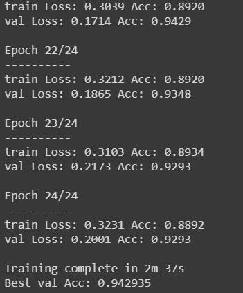
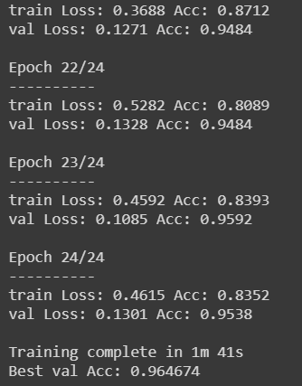

1. 这是一个图片分类的项目：

2. 环境：谷歌的免费GPU，cloab

3. 数据：使用python爬取的图片，一共三类：dog，fish，butterfly

- 狗：train：265张，val：143张 

- 鱼：train：243张，val：124张 

- 蝴蝶：train：214张， val：101张 

**该项目使用了两种训练方法，都属于迁移学习**

**第一种**：使用resnet18的预训练网络。将已经训练好的resnet网络参数作为初始参数。

​				修改其输出的全连接层。使其适应我们的数据集。

训练的的过程：

**第二种**：使用预训练的resnet18网络，修改其全连接层，并把所有的参数冻结，将其作为特征提取器。

训练的的过程：

**总结**：可以看出第二种方法的准确率比较高。

​	由于我使用的三种类别的差异比较大，水陆空三种类别，网络能过很好的将其分类。

但是每种类别使用的品种有很多。训练集中的狗，鱼就有很多品种。如果每种类别使用单一的品种，网络训练出来的结果应该会更好。

**注：**

该项目的训练数据谷歌云盘链接：https://drive.google.com/file/d/1NTJRqiKCLMsCBC4YKcrJV8g3WH9PU7ZD/view?usp=sharing